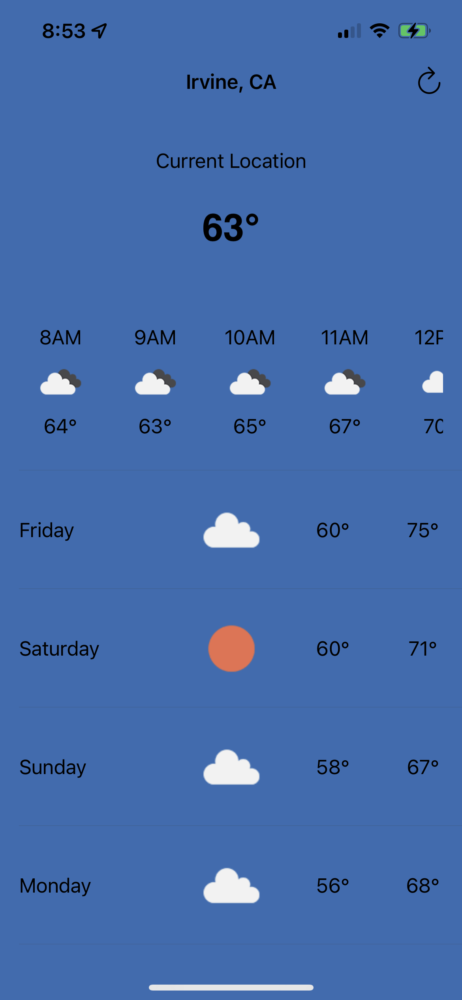
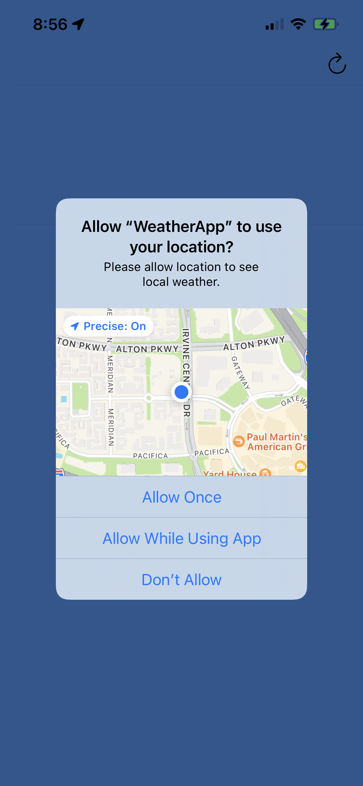
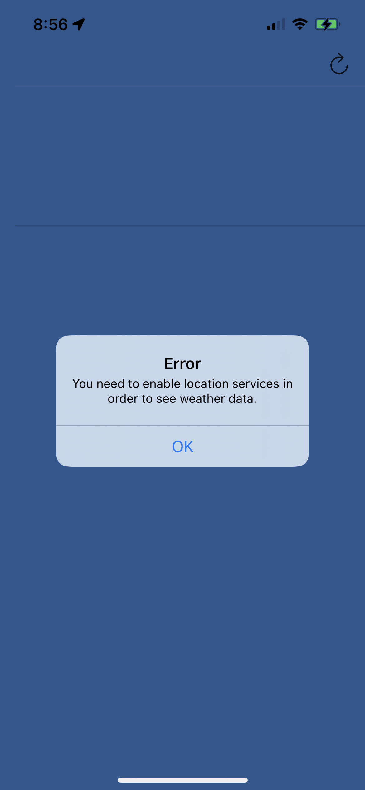

# [Weather App](https://github.com/cwjoshuak/iOSWeatherApp)

This is a simple weather app that utilizes the OpenWeatherMap One Call API to retrieve Hourly and Daily forecast.

The application can:-

- display current conditions up to 48 hours
- show responsive upcoming 7 day forecast
- allows user to refresh on demand
- works based on user location
- displays an alert if the user has denied location
- tested and works on iPhones targetting iOS 13 and above

## Screenshots

## Notes:

1. The app is limited by the API, a 7 day daily forecast is provided as the 10 day API endpoint requires a $40 subscription.
2. API key is not included, create your own: https://home.openweathermap.org/api_keys
